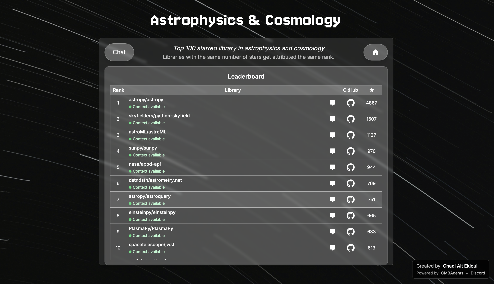

# Synapses

A modern platform to explore and rank the top 100 open source libraries by expertise domain.

## Overview

Synapses allows you to discover, compare, and interact with the most popular libraries across different domains. Each library is ranked according to its GitHub popularity and comes with detailed contexts automatically generated from existing documentation, docstrings, notebooks, and even code.

## Screenshots

### Main Interface

### Library Rankings

## Features

**Smart Rankings** : Ranking system based on GitHub stars with tie-breaking management

**Automatic Contexts** : Automatic generation of contextual documentation for each library taking into account existing documentation, docstrings, notebooks, and even code

**Modern Interface** : Responsive design with smooth animations and intuitive navigation

**Specialized Domains** : Focus on machine learning, astrophysics/cosmology, and finance/trading

## Technologies

- **Frontend** : Next.js 15, React 19, TypeScript
- **Styling** : Tailwind CSS with custom components
- **Backend** : Next.js API routes with Google Cloud integration
- **Documentation** : Automatic generation with contextmaker
- **Deployment** : Docker and Google Cloud Platform

## Contributing

Contributions are welcome! Check open issues or propose new features.

## License

This project is licensed under the MIT License. See the LICENSE file for details.

